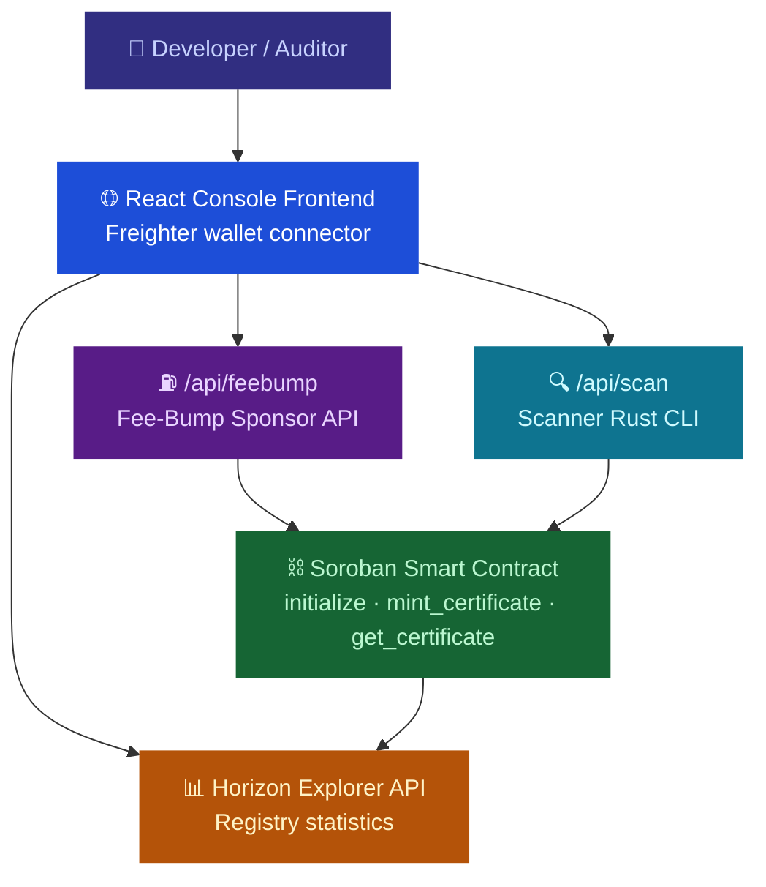

# 🛡️ SoroShield — Soroban Smart Contract Security Scanner & On-Chain Certifier

> **An automated static analysis security scanner and on-chain audit certifier that parses Rust contract integrity and stamps immutable certificates directly to the blockchain — built on Stellar & Soroban.**

---

## 🌟 Bridging the Security Gap

As the Stellar network embraces general-purpose smart contracts via Soroban, ensuring contract safety is paramount. Bugs on-chain lead to lost funds, storage leaks, and protocol panics.

**SoroShield** acts as a decentralized static analysis trust layer. It automatically reviews Rust smart contract code via visitor patterns inside an Abstract Syntax Tree (AST), identifies 10 critical vulnerability rules, and stamps a cryptographic audit certificate on the Stellar ledger — completely backed by gasless fee-bump transaction sponsorships.

---

## 💎 Core Pillars

| 🔍 AST Visitor Parser | ⛽ Gasless Fee Sponsorship | ⛓️ On-Chain Registry |
| :--- | :--- | :--- |
| Traverses Rust syntax structures using `syn` and `proc-macro2` visitors to pinpoint unchecked math, authorization leaks, and unbounded collections. | New auditors need **zero XLM** to start stamping certificates. SoroShield's sponsor backend covers ledger fees via Fee-Bumps. | Code integrity hashes are stamped on-chain, mapping the auditor's address, ledger sequence, and exact security profile metadata. |

---

## 🔗 Project Links

* **Local Dev Console**: [http://localhost:5173/](http://localhost:5173/)
* **Demo Video**: [Watch Demo Video](PLACEHOLDER_DEMO_VIDEO_URL)
* **Technical Blog Post**: [Read on Medium/Dev.to](./docs/technical_blog.md)
* **Outreach Thread**: [LinkedIn/Twitter Launch thread](./docs/marketing_drafts.md)
* **📋 User Feedback Form** *(Google Form)*: [Submit Feedback here](PLACEHOLDER_GOOGLE_FORM_URL)
* **📊 Exported User Responses** *(Google Sheet / Excel)*: [user_responses.xlsx](PLACEHOLDER_EXCEL_SHEET_URL)

---

## ⚡ Advanced Feature — Fee Sponsorship (Gasless Transactions)

SoroShield utilizes Stellar's native **Fee-Bump Transactions** to deliver gasless certificate minting.
* Developers or auditors connect Freighter and request to sign the certification envelope.
* SoroShield's Express API wraps the signed envelope into a Fee-Bump transaction signed by our treasury sponsor wallet.
* Network fees are sponsored entirely by SoroShield's treasury wallet.
* **Implementation Details**: API Route: [`api/src/server.ts`](./api/src/server.ts#L102-L189) · Frontend Helper: [`frontend/src/lib/stellar.ts`](./frontend/src/lib/stellar.ts#L45-L59).

---

## ⛓️ Deployed Smart Contracts (Stellar Testnet)

| Contract | Explorer Link | Local Test Suite |
|---|---|---|
| **SoroShield Core Registry** | [`CCLBUOFANQNQ26ACX3SOJG37MZDO2RGC7OCDWASZBUA6EFIQDASY2REM`](https://stellar.expert/explorer/testnet/contract/CCLBUOFANQNQ26ACX3SOJG37MZDO2RGC7OCDWASZBUA6EFIQDASY2REM) | 3/3 ✅ *(Zero-fee, rolling limit, stats flow)* |

---

## 📸 Application Interface

| Login Screen | Audit Workspace (Monaco Editor) |
| :---: | :---: |
|  |  |
| **Findings Panel** | **On-Chain Registry Directory** |
|  |  |

---

## 🏗️ Architecture

---

## 🔄 Audit & Certification Lifecycle

| Step | Initiator | Action |
| :---: | :--- | :--- |
| 1️⃣ | **Developer** | Pastes Rust smart contract into Monaco Editor workspace |
| 2️⃣ | **Express API** | Compiles code parsing CLI, runs Syn AST visitor engine, returns findings JSON |
| 3️⃣ | **Developer** | Fixes issues, clicks **Mint Certificate** and connects Freighter Wallet |
| 4️⃣ | **Frontend** | Simulates on-chain ledger footprint and constructs XDR envelope |
| 5️⃣ | **Sponsor API** | Receives envelope, wraps inside a `FeeBumpTransaction` signed by sponsor key, and submits to Horizon |
| 6️⃣ | **Registry** | Emits `CertificateMinted` event, locks hash, and updates global security stats |

---

## 🔒 Analyzer Security Rules

SoroShield scans for 10 core Soroban vulnerability classes:
1. **Missing `require_auth`**: Public functions modifying state or moving funds without verifying signatures.
2. **Unchecked Arithmetic Operators**: Usage of raw `+` or `-` operators that risk overflow or underflow.
3. **Missing Input Validation**: Numerical parameters (fees, amounts) left unvalidated.
4. **Unbounded Storage Collections**: Storage structures (Vec/Map) writing without size constraints.
5. **Unprotected Contract Upgrade**: Function calling `update_current_contract_wasm` without authorization checks.
6. **Missing Balance Verification**: Payout transfers executed without checking sufficiency balances.
7. **Abrupt Panics**: Unhandled calls to `unwrap()`, `expect()`, or `panic!` macros.
8. **Hardcoded Secrets**: Embedded private keys, secret seeds, or public addresses in source lines.
9. **Missing Event Emissions**: State changes executed without emitting events.
10. **Checks-Effects-Interactions (CEI)**: Reentrancy risks where storage state updates occur after external interactions.

---

## 🛠️ Tech Stack

| Layer | Technology |
| :--- | :--- |
| **Smart Contract** | Rust + Soroban SDK |
| **Static Scanner** | Rust Crate (`syn` + `proc-macro2` AST visitors) |
| **Frontend** | React 19 + Tailwind v4 + Monaco Editor Workspace |
| **Backend API** | Node.js + Express + TypeScript |
| **Blockchain** | Stellar Testnet (transitioning to Mainnet) |
| **Network SDK** | `@stellar/stellar-sdk` & `@stellar/freighter-api` |
| **Test Suites** | Cargo Test (contracts & scanner), Jest & Supertest (backend API) |

---

## ⬛ Level 6 — Black Belt Features

| Feature | Status | Details |
|---------|--------|---------|
| ⛽ Fee Sponsorship (Gasless) | ✅ Live | FeeBump transactions via `/api/feebump` |
| 📊 On-Chain Stats Monitoring | ✅ Live | Global cert count and scanned issues tracker via Horizon simulation |
| 🛡️ Security Hardening | ✅ Done | Covered zero-fee minting and roll caps eviction tests |
| 📝 User Onboarding Guide | ✅ Done | See [`docs/user_guide.md`](./docs/user_guide.md) |
| 📐 Technical Docs | ✅ Done | See [`docs/technical_blog.md`](./docs/technical_blog.md) |
| 🌐 Community Post | ✅ Done | Announcing SoroShield launch thread in [`docs/marketing_drafts.md`](./docs/marketing_drafts.md) |
| 👥 Verified Users | ⏳ Pending | Awaiting 20+ Mainnet user onboarding feedback logs |

---

## 📚 Documentation Directory

| Document | Description | Link |
|----------|-------------|------|
| 📖 **User Guide** | Walkthrough console login, scanning, and minting workflows | [Read Guide →](./docs/user_guide.md) |
| 📐 **Technical Architecture** | In-depth breakdown of Syn AST visitor patterns and fee-bump layout | [Read Tech Post →](./docs/technical_blog.md) |
| 🐦 **Outreach Threads** | Product launch announcement copy for LinkedIn/Twitter | [Read Marketing Drafts →](./docs/marketing_drafts.md) |
| 🧪 **Task Tracking** | Level 6 checklists and progress trackers | [Read TODO.md →](./TODO.md) |
